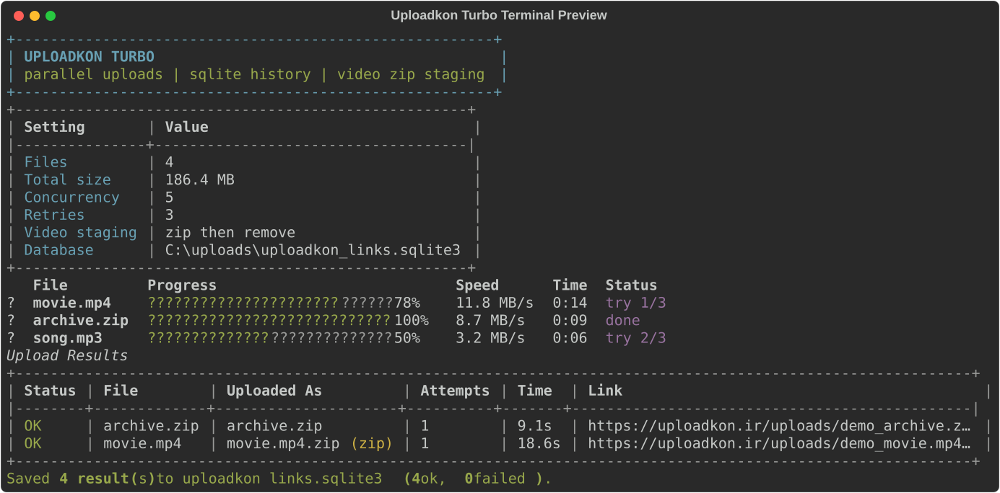

# Uploadkon Turbo

`Uploadkon Turbo` is a fast Python CLI for uploading files to `uploadkon.ir`, extracting the returned links, and saving the useful results into SQLite.

It is built for batch uploads: parallel workers, retry/backoff, random User-Agent rotation, colorful terminal progress, and automatic video-to-zip staging for video extensions that the host rejects directly.



## Features

- Parallel uploads with configurable concurrency
- Rich terminal UI with banner, colors, progress bars, transfer speed, elapsed time, and retry state
- SQLite history with WAL mode for reliable batch writes
- Automatic retry system with exponential backoff and jitter
- Random User-Agent per upload attempt, unless you pin one manually
- Optional cookie support for sessions that need browser cookies
- Directory upload support with recursive mode and glob filtering
- Automatic video staging: video files are zipped, uploaded as `.zip`, then the temporary zip is removed
- Skip already uploaded files by local path, size, and modified time

## Install

```powershell
python -m pip install -r requirements.txt
```

If Windows does not map `python`, use:

```powershell
py -m pip install -r requirements.txt
```

## Quick Start

Upload one file:

```powershell
python uploadkon.py "C:\path\to\file.zip"
```

Upload a folder with 5 parallel workers:

```powershell
python uploadkon.py "C:\path\to\files" --recursive --concurrency 5
```

Upload videos safely by letting the CLI zip them first:

```powershell
python uploadkon.py "C:\path\to\video.mp4"
```

The uploaded file name will be `video.mp4.zip`, and the temporary zip is deleted after the upload finishes.

## Useful Commands

Use a custom database:

```powershell
python uploadkon.py "C:\path\to\files" --db links.sqlite3
```

Skip files that are already stored successfully in the database:

```powershell
python uploadkon.py "C:\path\to\files" --recursive --skip-uploaded
```

Only upload zip files from a directory:

```powershell
python uploadkon.py "C:\path\to\files" --glob "*.zip"
```

Disable automatic video zipping:

```powershell
python uploadkon.py "C:\path\to\video.mp4" --no-zip-videos
```

Use browser cookies:

```powershell
$env:UPLOADKON_COOKIE = "name=value; other=value"
python uploadkon.py "C:\path\to\file.zip"
```

Pin a specific User-Agent:

```powershell
python uploadkon.py "C:\path\to\file.zip" --user-agent "Mozilla/5.0 ..."
```

Disable random User-Agent rotation:

```powershell
python uploadkon.py "C:\path\to\file.zip" --no-random-user-agent
```

## SQLite Output

Default database:

```text
uploadkon_links.sqlite3
```

Table:

```text
uploads
```

Saved columns:

- `file_path`
- `file_name`
- `file_size`
- `file_mtime_ns`
- `uploaded_file_name`
- `uploaded_file_size`
- `zipped`
- `status`
- `direct_url`
- `delete_url`
- `error`
- `attempts`
- `elapsed_ms`
- `uploaded_at`

The CLI intentionally does not save `forum_url` or the raw `response_json`.

## Notes

The upload request matches the browser AJAX flow:

- endpoint: `https://uploadkon.ir/`
- method: `POST`
- multipart fields: `submitr=1`, `ajax=1`, and file field `file`
- AJAX header: `X-Requested-With: XMLHttpRequest`

For video files, zipping uses `ZIP_STORED` for speed. Most video formats are already compressed, so recompressing them would usually waste time without making them meaningfully smaller.
